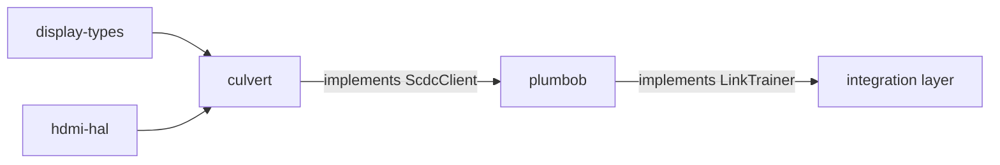

# culvert

[](https://github.com/DracoWhitefire/culvert/actions/workflows/ci.yml)
[](https://crates.io/crates/culvert)
[](https://docs.rs/culvert)
[](LICENSE)
[](https://blog.rust-lang.org/2025/02/20/Rust-1.85.0.html)
[](https://slsa.dev)

Typed access to the HDMI 2.1 SCDC register map.

`culvert` sits on top of [`hdmi_hal::scdc::ScdcTransport`] and gives raw SCDC register
bytes meaning: named structs, typed enums, and one method per register group for
scrambling control, FRL training primitives, version negotiation, update flags, and
Character Error Detection. It is the SCDC layer that [`plumbob`]'s link training state
machine drives, and is equally usable without it.

Sequencing of register operations — rate selection, timeout handling, retry logic — is
out of scope. Culvert provides the typed primitives; the caller decides when to call them.

## Usage

```toml
[dependencies]
culvert = "0.1"
```

Wrap your transport in `Scdc` and call typed methods:

```rust
use culvert::{Scdc, TmdsConfig, FrlConfig, FrlRate, FfeLevels};

let mut scdc = Scdc::new(transport);

// Version negotiation
let sink_ver = scdc.read_sink_version()?;
scdc.write_source_version(1)?;

// Enable TMDS scrambling
scdc.write_tmds_config(TmdsConfig {
    scrambling_enable: true,
    high_tmds_clock_ratio: true,
})?;

// Request an FRL rate
scdc.write_frl_config(FrlConfig {
    frl_rate: FrlRate::Rate12Gbps4Lanes,
    ffe_levels: FfeLevels::Ffe3,
    dsc_frl_max: false,
})?;

// Poll for training readiness
let flags = scdc.read_status_flags()?;
if flags.flt_ready {
    // sink is ready for the LTP loop
}

// Read per-lane character error counts
let ced = scdc.read_ced()?;
if let Some(count) = ced.lane0 {
    println!("lane 0 errors: {}", count.value());
}
```

To use culvert as the SCDC backend for `plumbob`'s link training state machine, enable
the `plumbob` feature:

```toml
[dependencies]
culvert  = { version = "0.1", features = ["plumbob"] }
plumbob  = "0.1"
```

`Scdc<T>` then implements `plumbob::ScdcClient` automatically.

## Register coverage

| Register group            | Addresses   | Methods |
|---------------------------|-------------|---------|
| Version                   | 0x01–0x02   | `read_sink_version`, `write_source_version` |
| Update flags              | 0x10–0x11   | `read_update_flags`, `clear_update_flags` |
| TMDS / scrambling         | 0x20–0x21   | `write_tmds_config`, `read_scrambler_status` |
| FRL config                | 0x30        | `write_frl_config` |
| FRL status                | 0x40–0x41   | `read_status_flags` |
| Character Error Detection | 0x50–0x57   | `read_ced` |

Registers not yet covered (RS Correction counters, DSC status, manufacturer
identification) are documented in [`doc/roadmap.md`](doc/roadmap.md).

## Features

| Feature   | Default | Description |
|-----------|---------|-------------|
| `plumbob` | no      | Implements `plumbob::ScdcClient` for `Scdc<T>` |

## `no_std`

`culvert` is `#![no_std]` throughout. All output types are stack-allocated; no allocator
is required in any configuration.

## Stack position



`culvert` does not depend on `plumbob`. The relationship runs the other way: enabling the
`plumbob` feature makes `Scdc<T>` implement `plumbob::ScdcClient`. Any crate that
implements `ScdcClient` is substitutable.

## Out of scope

- **Async API** — an async variant will live in a separate `culvert-async` crate.
- **Link training state machine** — the sequencing of FRL training (rate selection,
  polling, fallback to TMDS) belongs in the link training crate. Culvert provides the
  register operations; the state machine decides when to call them.
- **PHY configuration** — `HdmiPhy` operations are the link training layer's concern.
- **I²C / DDC transport** — platform backends implement `ScdcTransport` from `hdmi-hal`.
  Culvert never touches I²C directly.

## Documentation

- [`doc/setup.md`](doc/setup.md) — build, test, and coverage commands
- [`doc/testing.md`](doc/testing.md) — testing strategy, transport harness, and CI expectations
- [`doc/architecture.md`](doc/architecture.md) — role, scope, register map, type
  reference, design principles, and the culvert / link training boundary
- [`doc/roadmap.md`](doc/roadmap.md) — SCDC registers deferred to future releases

## Verifying releases

Each release is built on GitHub Actions and attested with
[SLSA Build Level 2](https://slsa.dev) provenance. To verify a release
`.crate` against its signed provenance, install the
[GitHub CLI](https://cli.github.com/) and run:

```sh
gh attestation verify culvert-X.Y.Z.crate --repo DracoWhitefire/culvert
```

The attested `.crate` is attached to each
[GitHub release](https://github.com/DracoWhitefire/culvert/releases).

## License

Licensed under the [Mozilla Public License 2.0](LICENSE).
